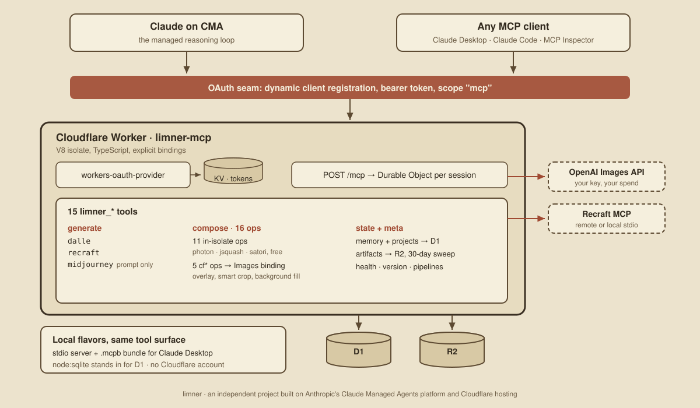

# Limner : A Harnessed Image-generation Agent

<p align="center"></p>

> A Harnessed Image-generation Agent: Claude reasons, Cloudflare executes, D1 remembers, OAuth is the only way in.

[](https://modelcontextprotocol.io)
[](https://developers.cloudflare.com/workers/)
[](https://www.typescriptlang.org/)
[](https://nodejs.org)
[](https://github.com/vinsonconsulting/limner/actions/workflows/ci.yml)
[](https://opensource.org/licenses/Apache-2.0)
[](https://developercertificate.org/)

Limner is an Agent Harness and  Model Context Protocol (MCP) server for orchestrating image
generation across multiple pipelines, with durable memory for project
context. This repository is **rasa**, the foundation variant of the Limner
family. You deploy limner: rasa as your own instance; free-as-in-beer and no strings/data-pipelines attached.

## The Harnessed Agent

Limner is explicitly built as a compstable harness structure with clean seams:

- **The reasoning loop runs on Anthropic's Claude Managed Agents platform.**
  The model does the planning and the tool choice. It never holds provider
  credentials and never executes code.
- **Tool execution runs in Cloudflare V8 isolates.** Every tool call lands in
  a Worker: deterministic TypeScript with explicit bindings, not a shell.
  Image composition happens in-isolate (WASM codecs, raster ops, text
  rendering) so the common path costs nothing and leaks nothing.
- **The seam between them is an OAuth-gated MCP surface.** The agent reaches
  the tools the same way any MCP client does: dynamic client registration,
  a bearer token, and a typed tool contract at `/mcp`. There is no private
  side channel.
- **Memory is a database, not a context window.** Project briefs, style
  decisions, and progress notes live in D1 and survive across sessions.
  The agent recalls what it recorded last week instead of being re-told.

The same tool surface ships three ways from one codebase: the OAuth-gated
Workers endpoint, a local stdio server, and a `.mcpb` one-click bundle for
Claude Desktop. The stdio server identifies itself as `limner-mcp (preview)`:
stdio is the preview transport at v1, pending a refresh against the next MCP
spec revision. The Workers and `.mcpb` surfaces carry no preview tag.

## Decisions and dead-ends

The design did not arrive fully formed. The full record lives in
[docs/Limner_Cloudflare_CMA_Architecture.md](docs/Limner_Cloudflare_CMA_Architecture.md):
22 dated decision records, a cost model, and five named off-ramp triggers that
state in advance what would make us walk away from the approach.

Several of those records are reversals. The FastAPI shim that fronted the first
design was killed. The Sharp/libvips composition path was abandoned for a hybrid
WASM stack that runs inside the isolate. Recraft began as a composed first-party
MCP and was later amended to a direct REST call, with the transport seam kept as
a reusable adapter. One record is a correction: a request timed out at 30s during
integration testing and was first blamed on an upstream API, until the API's own
docs turned up an async mode and the fault turned out to be ours.

The "Deploy to Cloudflare" button is the cleanest dead-end (currently). We ran the spike on
2026-06-12. The button's monorepo mode extracts a single package into a standalone
repo, which severs the `@limner/core` workspace dependency and breaks the build.
Provisioning and secrets worked; the repo shape did not. The full note, and the
script that does the same job plus migrations and a smoke test, is under
[Where is the Deploy to Cloudflare button?](#where-is-the-deploy-to-cloudflare-button).

## Architecture

<p align="center"></p>

## Stack

- TypeScript pnpm monorepo: `@limner/core` (pipelines, composition, state),
  `@limner/mcp` (the server, all three transports), `@limner/cma-tools`
  (the same tool contract packaged for CMA custom-tool consumption)
- Cloudflare Workers, D1, KV, R2, Durable Objects, Images
- Composition: Photon and jSquash (WASM), Satori + resvg for typography,
  Cloudflare Images for the network-side ops
- MCP over Streamable HTTP and stdio

The architecture document with decision records lives at
[docs/Limner_Cloudflare_CMA_Architecture.md](docs/Limner_Cloudflare_CMA_Architecture.md).

## Tool Surface

All tools are namespaced `limner_*`. Full schemas in
[packages/limner-mcp/README.md](packages/limner-mcp/README.md).

| Tool | What it does | Needs |
| --- | --- | --- |
| `limner_generate_dalle` | OpenAI Images API (gpt-image-1 default) | `OPENAI_API_KEY`, your OpenAI credit |
| `limner_generate_recraft` | Recraft, via their REST API (`external.api.recraft.ai`) | `RECRAFT_API_KEY`, your Recraft credit |
| `limner_generate_midjourney` | Composes a Midjourney prompt string; a human carries it the rest of the way | Nothing |
| `limner_compose` | 16 image ops behind one discriminated union: resize, crop, brightness, contrast, blur, sharpen, watermark, encode, decode, convert, renderText run in-isolate; cfTransform, cfOverlay, cfBlur, cfSmartCrop, cfBackgroundFill use Cloudflare Images | Images binding for the five cf* ops only |
| `limner_record` / `limner_recall` / `limner_forget` / `limner_list_categories` | Durable memory with categories and idempotent upserts | D1 (or local SQLite) |
| `limner_list_projects` / `limner_get_project_context` / `limner_record_project_note` | Project briefs and running notes | D1 (or local SQLite) |
| `limner_health` / `limner_version` / `limner_list_pipelines` / `limner_pipeline_capabilities` | Discovery and diagnostics | Nothing |

## Prerequisites

For a self-deployed Workers stack:

- A Cloudflare account with Workers, D1, and KV available (the free plan
  covers all three, including SQLite Durable Objects)
- R2 enabled on the account (free tier; the artifact bucket is created for
  you)
- **A Cloudflare Images paid plan** for the five `cf*` compose ops at real
  usage volumes
- An OpenAI API key and a Recraft API key. Both are required up front; the
  generation tools spend your own provider credit
- Node per [.nvmrc](.nvmrc) (22; floor 22.13) and pnpm 10

A note on the Images free tier: Cloudflare includes 5,000 unique
transformations per month on every account, after which the cf* ops return
errors until the month rolls over. That allowance is fine for kicking the
tires; treat the paid plan as the requirement for actual use. The eleven
in-isolate compose ops never touch Images and stay free everywhere.

Local stdio and `.mcpb` need no Cloudflare account at all: state goes to
local SQLite, and the cf* compose ops refuse cleanly.

## Quickstart

Pick the heaviest option you have patience for. They all end at the same
tool surface.

### Provisioning script

```bash
git clone https://github.com/vinsonconsulting/limner.git
cd limner
pnpm install --frozen-lockfile
pnpm setup:cloudflare
```

The script checks your wrangler login, provisions D1, KV, and R2 by name
(re-running is safe), pins the resource ids into the wrangler config,
applies the schema migration, builds, deploys, prompts for both provider
keys, smoke-tests the deployed endpoint, and prints connect instructions
for Claude Desktop, Claude Code, and MCP Inspector.

Optional: `pnpm setup:cloudflare --with-example-seed` loads a small generic
memory seed (a fictional postcard project) so the memory tools have
something to recall on day one. `--env production` provisions the separate
production environment, and `--dry-run` shows the plan without changing
anything.

### Where is the Deploy to Cloudflare button?

Sigh... we tried, in a live spike (2026-06-12). The button's monorepo mode
extracts `packages/limner-mcp` into a standalone repository, which severs
the `@limner/core` workspace dependency, so the build cannot succeed
regardless of build settings. Its provisioning and secrets flow worked
well; the repo shape is the blocker. The script above does everything the
button would, plus migrations and a smoke test. If the button gains
in-place monorepo support, it returns here.

For push-to-deploy CI/CD in the meantime, connect your fork through the
dashboard: Workers and Pages, import the repository, root directory `/`,
build command `pnpm install --frozen-lockfile && pnpm -r build`, deploy
command `pnpm --filter @limner/mcp run deploy`. That flow keeps the full
repository, so the workspace resolves.

### Manual

The script above is a convenience wrapper over five wrangler commands; the
by-hand version is in the comments of
[packages/limner-mcp/wrangler.toml](packages/limner-mcp/wrangler.toml).
Short form: `wrangler d1 create limner-rasa-dev`, `wrangler kv namespace
create OAUTH_KV`, `wrangler r2 bucket create limner-rasa-artifacts-dev`,
pin the printed ids in the config, then `wrangler d1 migrations apply
limner-rasa-dev --remote`, `wrangler secret put` both keys, and
`wrangler deploy`.

### Local stdio (no Cloudflare account)

```bash
git clone https://github.com/vinsonconsulting/limner.git
cd limner
pnpm install --frozen-lockfile
pnpm -r build
OPENAI_API_KEY=sk-... RECRAFT_API_KEY=... node packages/limner-mcp/dist/stdio.js
```

For Claude Desktop, add to
`~/Library/Application Support/Claude/claude_desktop_config.json`:

```jsonc
{
  "mcpServers": {
    "limner": {
      "command": "node",
      "args": ["/absolute/path/to/limner/packages/limner-mcp/dist/stdio.js"],
      "env": { "OPENAI_API_KEY": "sk-...", "RECRAFT_API_KEY": "..." }
    }
  }
}
```

### `.mcpb` bundle (Claude Desktop one-click)

Download the `.mcpb` from a GitHub release (built on `mcpb-v*` tags), open
it with Claude Desktop, and fill in the API-key prompts. Or build your own:
`pnpm pack:mcpb`.

### Connecting a client to a deployed Worker

```bash
claude mcp add --transport http limner https://limner-mcp.<your-subdomain>.workers.dev/mcp
```

Claude Desktop: Settings, Connectors, add a custom connector with the same
URL. MCP Inspector: `npx @modelcontextprotocol/inspector`, then connect
with the Streamable HTTP transport. OAuth dynamic client registration
handles credentials in all three cases.

## Testing and feedback

[docs/TESTING.md](docs/TESTING.md) is the tester's checklist, ordered
free-first and paid-last, with the cost of every step stated up front.
Findings are public issues: use the
[test finding](.github/ISSUE_TEMPLATE/test_finding.yml) or
[bug report](.github/ISSUE_TEMPLATE/bug_report.yml) template.

## The Limner family

Limner is a family of model harnesses. Each variant builds on **rasa** (this
repo) and adds opinions for a specific creative niche.

| Repo | Status | Focus |
|---|---|---|
| `vinsonconsulting/limner` (this repo) | rasa, foundation | General-purpose; OSS |
| `vinsonconsulting/limner-pixel` | in development, not yet public | Pixel art, sprite work, retro game asset pipelines |
| `vinsonconsulting/limner-ascii` | pre-development skill building, not yet public | ASCII art workflows |

Specialty pipelines (pixel-art generators like Pixellab and RetroDiffusion)
are being built in `limner-pixel` (not yet public); rasa stays
general-purpose. The legacy proprietary work that preceded the OSS pivot is
kept private at `vinsonconsulting/limner-pixel-legacy`.

## Contributing

Contributions welcome. See [CONTRIBUTING.md](CONTRIBUTING.md). All commits
need a [Developer Certificate of Origin](https://developercertificate.org/)
sign-off via `git commit -s`; the DCO check gates merge.

## License

Apache 2.0. See [LICENSE](LICENSE).

## Acknowledgments

Limner is built on [Anthropic's Claude Managed Agents](https://claude.com/blog/claude-managed-agents-updates) platform and [Cloudflare's CMA hosting](https://blog.cloudflare.com/claude-managed-agents/). Limner is an independent project; "built on" does not imply endorsement by Anthropic or Cloudflare.

---

<p align="center"></p>
<p align="center"><sub>The hero above, translated to pixel art by PixelLab, the pipeline being built as <code>limner-pixel</code>. The family renders its parent.</sub></p>
